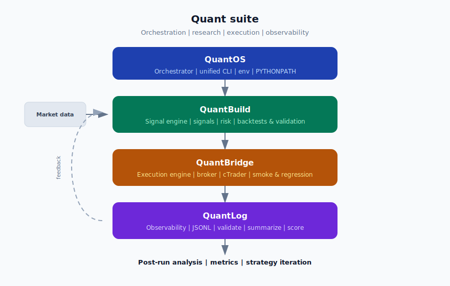

# quantmetrics_os

**Orchestrator for the Quant suite:** sibling checkouts **`quantbuild`** (signals/risk), **`quantbridge`** (execution), **`quantlog`** (JSONL observability), **`quantanalytics`** (read-only JSONL analytics).

This repository is the **front door**: one place to resolve paths, environment, and subprocess entrypoints so research, execution, and observability run as a single system — not three disconnected scripts. *(Older docs may say “QuantMetrics OS”; same repo.)*

**Clone folder on disk:** `quantmetrics_os/` (matches the default GitHub repo name until you rename the remote).

*Nederlandstalige details en handouts: zie [`docs/`](docs/).*

### Suite repositories (GitHub)

| Repo | Remote |
| --- | --- |
| `quantmetrics_os` (**this**) | [roelofgootjesgit/quantmetrics_os](https://github.com/roelofgootjesgit/quantmetrics_os) |
| `quantbuild` | [roelofgootjesgit/QuantBuild-Signal-Engine](https://github.com/roelofgootjesgit/QuantBuild-Signal-Engine) |
| `quantbridge` | [roelofgootjesgit/quantbridgev1](https://github.com/roelofgootjesgit/quantbridgev1) |
| `quantlog` | [roelofgootjesgit/quantlogv1](https://github.com/roelofgootjesgit/quantlogv1) |
| `quantanalytics` | [roelofgootjesgit/quantanalyticsv1](https://github.com/roelofgootjesgit/quantanalyticsv1) |

*Fork under another user? Update links or use `GITHUB_USER` in [`scripts/clone_quant_suite.sh`](scripts/clone_quant_suite.sh).*

---

## Architecture



<details>
<summary>Plain-text diagram (fallback)</summary>

```
                    ┌────────────────────┐
                    │  quantmetrics_os   │  paths, env, unified CLI
                    └─────────┬──────────┘
                              │
   Market data ───────────────┼──────────────────────────────┐
                              ▼                              │
                    ┌────────────────────┐                     │
                    │   quantbuild     │  signals, risk,    │
                    │                    │  strategy loop     │
                    └─────────┬──────────┘                     │
                              ▼                              │
                    ┌────────────────────┐                     │
                    │  quantbridge     │  broker execution, │
                    │                    │  cTrader / IC path │
                    └─────────┬──────────┘                     │
                              ▼                              │
                    ┌────────────────────┐                     │
                    │    quantlog      │  JSONL events,      │
                    │                    │  validate, reports  │
                    └─────────┬──────────┘                     │
                              └──────── post-run ──► quantanalytics (JSONL) ───┘
```

</details>

---

## What each repo proves

| Repo | What it demonstrates |
| --- | --- |
| `quantmetrics_os` | You treat the stack as **production software**: explicit wiring, reproducible launches, and a clear seam between orchestration and domain code. |
| `quantbuild` | **Systematic edge**: backtests, risk gates, prop-style constraints (e.g. FTMC), and a test-backed signal/risk core — not a discretionary script. |
| `quantbridge` | **Execution discipline**: broker integration, smoke/regression paths, and operational concerns (reconnect, health) separated from alpha. |
| `quantlog` | **Auditability**: append-only structured events, validation, and day-level scoring — the feedback loop that turns logs into improvements. |
| `quantanalytics` | **Post-run insight** (read-only): funnel, no-trade reasons, and performance summaries from the same JSONL as `quantlog` — no mutation of logs. |

---

## What lives in *this* repo

| Path | Role |
| --- | --- |
| `orchestrator/quantmetrics.py` | Loads `orchestrator/.env`, resolves sibling repo roots, runs `python -m …` and scripts with correct `cwd` / `PYTHONPATH`. |
| `orchestrator/qm.ps1` | Windows-friendly wrapper. |
| `orchestrator/config.example.env` | Template for `QUANTBUILD_ROOT`, `QUANTBRIDGE_ROOT`, `QUANTLOG_ROOT`, optional `PYTHON`, configs. |
| `orchestrator/config.vps.example.env` | VPS / Linux layout hints. |
| `vscode/quant-suite.code-workspace` | Multi-root workspace (OS + Build + Bridge + Log); add `quantanalytics` locally if you use the analytics repo in the same tree. |
| `scripts/clone_quant_suite.sh` | Optional clone/update helper and baseline `.env`. |
| `docs/` | Roadmap, sprint plan, suite handouts. |

Strategy, broker adapters, and event schemas live in the **sibling repositories**, not here.

---

## Quick start

**Layout** (sibling folders under one parent):

```text
<parent>/
  quantmetrics_os/     ← this repo
  quantbuild/
  quantbridge/
  quantlog/
  quantanalytics/    ← optional: CLI analytics on JSONL
```

**Steps**

1. Copy `orchestrator/config.example.env` → `orchestrator/.env` and set `QUANTBUILD_ROOT`, `QUANTBRIDGE_ROOT`, `QUANTLOG_ROOT`, and optionally **`QUANTANALYTICS_ROOT`** (see `config.vps.example.env`).
2. Install **`quantanalytics`** editable into the QuantBuild venv when you use analytics: `pip install -e ../quantanalytics`.
3. From `orchestrator/`:

   ```powershell
   python quantmetrics.py build -c configs/strict_prod_v2.yaml
   ```

   On Windows you can use `.\qm.ps1` if your wrapper forwards the same arguments.

4. Examples (see `python quantmetrics.py --help`):

   | Goal | Command |
   | --- | --- |
   | `quantbuild` live (paper; no `--real`) | `python quantmetrics.py build -c configs/strict_prod_v2.yaml` |
   | `quantbuild` backtest | `python quantmetrics.py backtest -c configs/foo.yaml` |
   | Backtest **then** JSONL analytics report | `python quantmetrics.py backtest -c configs/foo.yaml --analyze` |
   | Analytics only on a QuantLog `.jsonl` | `python quantmetrics.py analyze --jsonl path/to/run.jsonl` |
   | `quantbridge` mock regression suite | `python quantmetrics.py bridge regression` |

Use `python quantmetrics.py --help` and per-subcommand `--help` for full options.

**`quantbuild` + live bridge:** set `QUANTBRIDGE_SRC_PATH` to **`quantbridge`**’s `src` directory so build can load the bridge module — see [Suite start handout](docs/SUITE_START_HANDOUT.md).

---

## Requirements

- Python on the host (or per-repo venvs); override with `PYTHON` in `.env` if needed.
- Cloned **`quantbuild`**, **`quantbridge`**, and **`quantlog`** with paths in `.env` (clone **`quantanalytics`** beside them when you run post-run JSONL reports).

---

## Documentation

- [GitHub profile README (template to paste)](docs/GITHUB_PROFILE_README.md) — landing page for `github.com/<you>/<you>`.
- [Suite showcase (technical CV)](docs/SHOWCASE.md) — problem, architecture rationale, validation, deployment roadmap.
- [Suite start (handout)](docs/SUITE_START_HANDOUT.md) — `.env`, common commands, workspace, `QUANTBRIDGE_SRC_PATH`.
- [Roadmap](docs/Roadmap_os.md)
- [Sprint plan](docs/QUANTMETRICS_SPRINT_PLAN.md)
